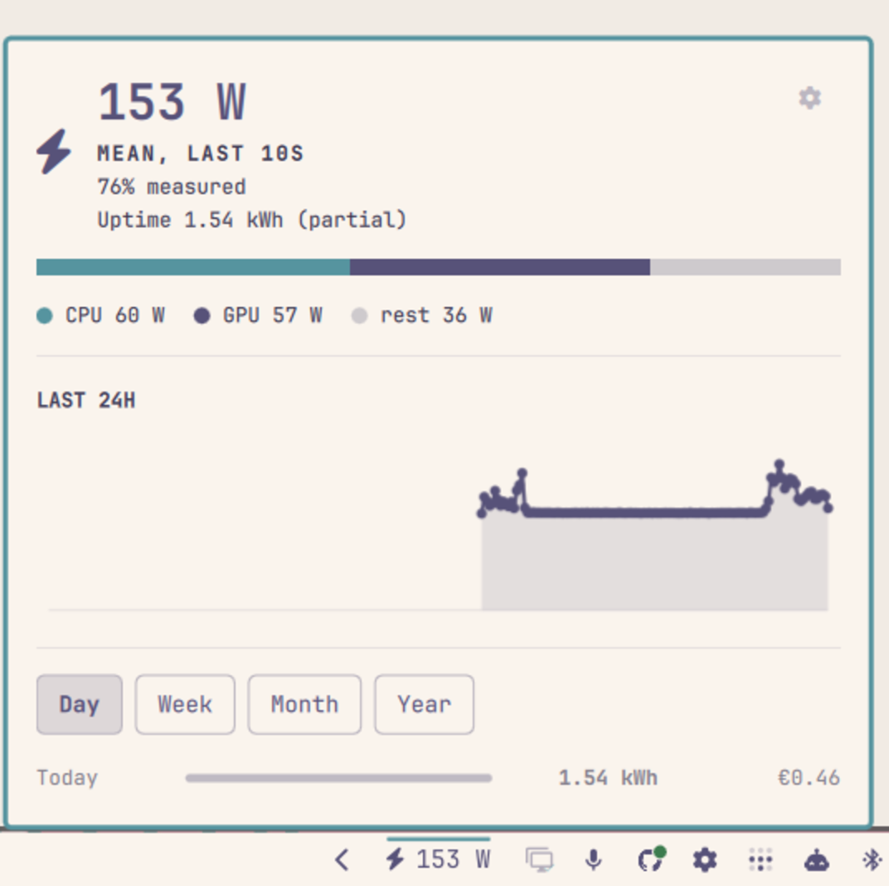
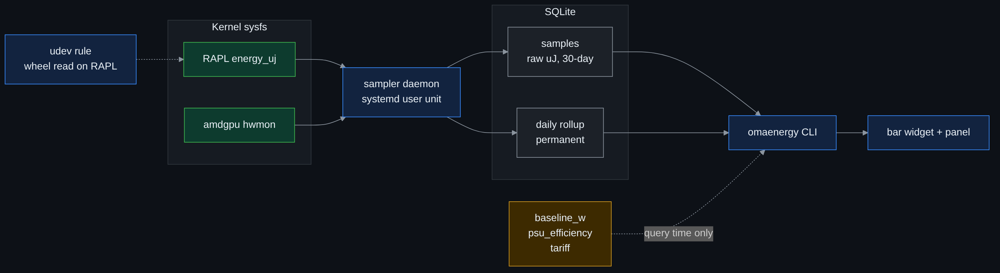

# Energy Meter

Live power draw on the Omarchy bar, and a panel that breaks your machine's
energy use and cost down by **day, week, month, and year**.

Most power widgets are wattmeters: they tell you what the machine is drawing
right now and forget it a second later. This one is an **energy meter** — it
integrates and keeps a permanent daily rollup, so you can answer "what did this
computer actually cost me last month?"

<p align="center">
  
</p>

It is built around one rule: **never present an estimate as a measurement.**
CPU and GPU draw are read from hardware. The rest of the machine cannot be, so
it is an explicit, calibratable constant — and the UI always shows you what
fraction of the number is real.

---

## Why this exists

Most people have no way to find out what their computer costs to run. A smart
plug or an in-home energy display answers it instantly, but that means buying
hardware, and plenty of houses have neither — a utility meter in a cupboard
that reports once a month tells you about the whole house, not about this
machine.

Meanwhile the machine already knows. Modern CPUs and GPUs carry energy and
power counters the kernel exposes for free; they are simply never accumulated,
so the information evaporates every second. This plugin does the accumulating:
**no extra hardware, nothing to buy, and a permanent record from the day you
install it.**

What that gets you is the part that is genuinely hard to guess:

- **Consumption over time, not a snapshot.** What a week of your actual work
  costs, not what the machine draws in the instant you happen to look.
- **Which days were expensive, and why.** A day of compiling and a day of
  reading email differ by a factor of three, and the breakdown separates them
  from the days the machine was simply switched off.
- **A number you can put against a bill.** Not to the cent, but close enough
  to know whether this machine is a rounding error on your electricity bill or
  a real line item — and close enough to tell whether a change you made
  (undervolting, a power profile, leaving it on overnight) actually mattered.

It is not a replacement for a wall meter, and it does not pretend to be: the
CPU and GPU are measured, the rest of the machine is an estimate you can
[calibrate](#accuracy-and-how-to-calibrate-it-away), and every screen tells
you which is which. If you do own a smart plug, use it to calibrate this once
and the two agree closely from then on.

---

## Contents

- [Why this exists](#why-this-exists)
- [Install](#install)
- [What you get](#what-you-get)
- [What is measured and what is estimated](#what-is-measured-and-what-is-estimated)
- [How the numbers are calculated](#how-the-numbers-are-calculated)
- [Accuracy, and how to calibrate it away](#accuracy-and-how-to-calibrate-it-away)
- [CLI](#cli)
- [Settings](#settings)
- [Architecture](#architecture)
- [Hardware support](#hardware-support)
- [Correctness notes](#correctness-notes)
- [Troubleshooting](#troubleshooting)
- [Uninstall](#uninstall)
- [Contributing](#contributing)
- [Changelog](#changelog)

---

## Install

Two steps, because `omarchy plugin add` only copies files — it never runs
install hooks and never runs `sudo`. The bar widget is the first step; the
sampler that produces its data is the second.

```bash
# 1. the widget
omarchy plugin add https://github.com/kevzakaria/omarchy-energy-meter.git --enable

# 2. the sampler daemon (+ the one root step, explained below)
~/.config/omarchy/plugins/io.github.kevzakaria.energy-meter/install.sh

# 3. your electricity price — the default is a placeholder, not your tariff
omaenergy config tariff=0.42 currency=EUR
```

Step 3 is also the gear in the panel's top-right corner, and it is retroactive:
set it whenever you find your last bill, and every figure the meter has ever
recorded is repriced.

`install.sh` is idempotent, prints what it will do before doing it, and needs
root for exactly one thing: a udev rule. Pass `--no-udev` to skip that and see
what you get without it.

<details>
<summary><b>Why the root step exists, and what the rule does</b></summary>

CPU energy comes from RAPL, at `/sys/class/powercap/*/energy_uj`. Upstream
Linux made that file root-only in response to
[CVE-2020-8694](https://nvd.nist.gov/vuln/detail/CVE-2020-8694) (PLATYPUS: RAPL
is a power side channel, and at high sample rates it can leak key material).

The rule grants **read** access to group `wheel`, and nothing else:

```
ACTION=="add", SUBSYSTEM=="powercap", KERNEL=="intel-rapl:*", \
  RUN+="/usr/bin/chgrp wheel /sys%p/energy_uj", \
  RUN+="/usr/bin/chmod 0440 /sys%p/energy_uj"
```

`wheel` already holds `sudo` on an Omarchy system, so this confers no privilege
that group did not already have. It is read-only, scoped to one attribute, and
`uninstall.sh` removes it. If you would rather not, `--no-udev` leaves the GPU
term working and reports the CPU term as unavailable rather than guessing it.

</details>

Data starts accumulating at install time. RAPL counters are volatile and carry
no history, so **there is no way to recover consumption from before the daemon
first ran** — the sooner it is running, the sooner the monthly view means
something.

---

## What you get

**On the bar** — a bolt and the live figure. Right-click cycles what it shows:
live watts → today's kWh → this month's kWh. It goes to the theme's urgent
colour above a configurable threshold, and dims to `⚡ —` if the backend stops
answering (it will never show you a stale number styled as a live one).

<p align="center">
  
</p>

**In the panel**

| | |
|---|---|
| Hero | Current draw, with a CPU / GPU / rest stacked bar whose segments sum exactly to the total, and the share of the reading that is hardware-measured |
| Sparkline | Last 24 hours, hover for a crosshair readout |
| Breakdown | Day / week / month / year, each row with energy, cost, average while tracked, and largest sample |
| Coverage | Any bucket that was not fully sampled is marked, so a day the machine was off for 18 hours never reads as a low-consumption day |
| Settings | A gear in the top-right corner opens a config pane: price, currency, the estimate constants, and the sampling options, each with its units and what it does |

The main view carries numbers and nothing else — no disclaimer paragraph, no
tariff line. The explanation of *why* the total is an estimate lives in the
settings pane, next to the two constants that make it one, which is where
someone reading it can act on it. What stays on the front is the live
`81% measured` figure, because that is a measurement, not prose.

The pane is also reachable without the mouse, so you can bind it:

```bash
omarchy-shell io.github.kevzakaria.energy-meter settings
```

---

## What is measured and what is estimated

This table is the most important thing in this README.

| Term | Source | Real? |
|---|---|---|
| **CPU / SoC** | RAPL `package-*` energy counter. On AMD this is MSR `C001_029B` — the whole socket: core complexes plus the I/O die | **Measured.** A true accumulating energy counter, so its integral is exact at any sample rate |
| **GPU** | amdgpu hwmon `power1_average` (label `PPT`) | **Measured, integrated.** Not a counter — a firmware-filtered power estimate in whole watts, integrated by sampling. See [GPU sampling](#gpu-sampling-is-quadrature-not-counting) |
| **DRAM, NVMe, SATA, fans, chipset, USB** | `baseline_w` constant | **Estimated.** A typical desktop board exposes no sensor for any of it |
| **PSU conversion loss** | `psu_efficiency` constant | **Estimated.** Not observable from inside the machine at all |

RAPL's package domain does **not** include DIMMs, the discrete GPU, or the
chipset, so `baseline_w` fills a genuine gap rather than double counting the
IOD. (Verified against the kernel's `amd_energy` documentation and
`drivers/powercap/intel_rapl_msr.c`, and empirically: loading all 32 threads
moved the package figure from 41.6 W to 130.6 W while GPU PPT stayed flat.)

---

## How the numbers are calculated

### The one design decision that matters

**The database stores only measured microjoules and the duration they were
measured over.** `baseline_w`, `psu_efficiency` and `tariff` are applied at
*query* time, never written into a row.

That means recalibrating the baseline, correcting your PSU efficiency, or
fixing your electricity price **retroactively corrects your entire history**.
If the estimates were baked in at sample time, you would have to throw the
history away and start again. (This already paid for itself: a 1000× unit-bug
in the kWh conversion was fixed with no data loss, because the stored rows were
raw joules.)

<p align="center">
  
</p>

### Per sample

The CPU term is a delta of an accumulating counter, taken modulo its wrap
range:

$$E_{\text{cpu}} = (C_{\text{now}} - C_{\text{prev}}) \bmod R \quad [\mu\text{J}]$$

where $R$ is `max_energy_range_uj`. The GPU term has no counter, so it is
integrated by the trapezoid rule over sub-samples taken every
`gpu_interval_s`:

$$E_{\text{gpu}} = \sum_{i} \frac{P_i + P_{i-1}}{2}\,\Delta t_i \times 10^{6} \quad [\mu\text{J}]$$

Both go into the row along with $\Delta t$. Nothing else does.

### At query time

Energy for any bucket, as it would appear at the wall socket:

$$E_{\text{socket}} = \frac{E_{\text{cpu}} + E_{\text{gpu}} + P_{\text{base}} \cdot t_{\text{tracked}}}{\eta_{\text{PSU}}}$$

$$\text{kWh} = \frac{E_{\text{socket}}\,[\mu\text{J}]}{3.6 \times 10^{12}}
\qquad\text{since } 1\,\text{kWh} = 3.6\times10^{6}\,\text{J} = 3.6\times10^{12}\,\mu\text{J}$$

$$\text{cost} = \text{kWh} \times \text{tariff}$$

Every watt and kWh the tool reports is **at-socket**: each measured component
is divided by $\eta_{\text{PSU}}$ individually and the estimate is added in, so
the parts always sum to the whole — `cpu_w + gpu_w + rest_w == watts` and
`cpu_kwh + gpu_kwh + rest_kwh == kwh`, exactly. The raw sensor-side values are
still available as `cpu_dc_w` and `gpu_dc_w` for calibration.

### Worked example, with real output

```console
$ omaenergy now
  now        183.6 W    at socket, mean over the last 10s
                        cpu 88.2 + gpu 59.4 + rest 36.0 (estimated)
                        80% of this reading is hardware-measured
  today        1.358 kWh  0.41 EUR
  month        1.358 kWh  0.41 EUR
  boot         1.358 kWh  (partial — not sampled for the whole boot)
```

Sensors read 78.5 W CPU and 52.9 W GPU on the DC side, with
`baseline_w = 32`, `psu_efficiency = 0.89`, `tariff = 0.30`:

| Step | Value |
|---|---|
| $88.2 = 78.5 / 0.89$ | CPU at socket |
| $59.4 = 52.9 / 0.89$ | GPU at socket |
| $36.0 = 32 / 0.89$ | estimated remainder at socket |
| $183.6 = 88.2 + 59.4 + 36.0$ | total — the parts add up |
| $0.804 = (78.5 + 52.9)/(78.5 + 52.9 + 32)$ | measured share, shown as 80% |

And the same day as a bucket:

```console
$ omaenergy day
                   kWh      cost      avg      max
                                  tracked  ~sample
  2026-09-13     1.358     0.41E     142W     245W  ██████████████████████  (9.5h tracked)
```

| Field | Meaning |
|---|---|
| `1.358 kWh` | $0.508_{\text{cpu}} + 0.508_{\text{gpu}} + 0.343_{\text{rest}}$ |
| `142 W` avg tracked | $1.358\,\text{kWh} \times 1000 / 9.536\,\text{h}$ — the average **while sampling**, not across the calendar day |
| `245 W` max sample | the largest single-interval **average**. A spike shorter than `interval_s` is averaged away, which is why this is never called a peak |
| `9.5h tracked` | coverage $= 9.536 / 11.49 = 0.83$ — the day is 83% sampled, so this row is a partial total and marked as one |

---

## Accuracy, and how to calibrate it away

Out of the box, expect the total to sit within roughly **±15–20% of a wall
meter**, dominated entirely by the two estimated constants.

What it gets *right* regardless is **trends and comparisons** — the part of the
draw that varies with what you are doing is the part that is genuinely
measured, so "this week was 40% heavier than last week" is trustworthy even
while the absolute figure carries a constant-offset uncertainty. At idle the
estimate is a large share of a small number; under load it is a small share of
a big one.

**With a wall meter (or a smart plug) you can remove most of that error in five
minutes:**

1. Let the machine idle. Read the metered watts, e.g. 105 W.
2. `omaenergy now --json` → take `cpu_dc_w` and `gpu_dc_w`, e.g. 41 and 15.
3. $P_{\text{base}} = (\text{metered} \times \eta) - (\text{cpu}_{dc} + \text{gpu}_{dc})$
   $= (105 \times 0.89) - 56 = 37.5$ W.
4. `omaenergy config baseline_w=37.5`. Your whole history is now corrected too.

If you know your PSU's efficiency curve, set `psu_efficiency` for your typical
load while you are there — 80+ Gold units sit near 0.90 at mid load and worse
when lightly loaded.

The default `baseline_w` follows your chassis type: **32 W** for a desktop
(four DIMM slots, several drives, case fans, chipset) and **12 W** for a laptop.
These are defensible starting points, not measurements of *your* machine.

---

## CLI

The widget is a thin client: it only ever renders JSON from this CLI, and never
touches sysfs itself.

```bash
omaenergy now                 # live draw, today, month to date, this boot
omaenergy day                 # last 14 days
omaenergy week -n 6           # last 6 ISO weeks
omaenergy month
omaenergy year -n 0           # every year on record (0 = all)
omaenergy chart --hours 24    # power over time
omaenergy status              # discovered sensors, database, configuration
omaenergy config              # show settings
omaenergy config tariff=0.42  # change the price per kWh, retroactively
omaenergy currencies          # codes it knows, with symbol and precision
```

Every subcommand takes `--json`. `status` is the one to paste into a bug report:
it reports which sensors were discovered and chosen, which were found and
deliberately not used, sample counts, and how many intervals were dropped.

---

## Settings

**Widget** — configurable from the bar's settings UI, stored in `shell.json`:

| Key | Default | |
|---|---|---|
| `refreshIntervalSec` | 5 | How often the bar polls the CLI. Does **not** change the sampling rate |
| `highWattThreshold` | 300 | Urgent colour at or above this many watts |
| `barLabelMode` | `watts` | `watts` / `todayKwh` / `monthKwh`. Right-click to cycle |

**Backend** — one source of truth, `~/.config/omarchy-energy/config.json`.
You never need to hand-edit it. Every key below is editable from the panel's
gear, and the same keys are settable from the terminal; both go through
`omaenergy config`, which validates, clamps and writes atomically:

```bash
omaenergy config                            # list everything, with what needs a restart
omaenergy config tariff=0.42                # your actual price per kWh
omaenergy config tariff=1444.7 currency=IDR # any currency
omaenergy config baseline_w=37.5            # after calibrating
```

| Key | Default | |
|---|---|---|
| `tariff` | 0.30 | **Price per kWh. Set this first** — the shipped value is a placeholder, not your tariff. Retroactive |
| `currency` | `EUR` | ISO code, picked from a searchable list in the settings pane. Decides the symbol and the natural precision: `€0.42`, `Rp 2,041`, `¥180`. Any 2–5 letter code is accepted, listed or not — see `omaenergy currencies` |
| `currency_symbol` | auto | Override the symbol if your currency is not in the table, or you simply prefer another glyph |
| `cost_decimals` | auto | Decimal places for money. `2` where a cent exists, `0` for IDR / JPY / KRW / VND where it does not |
| `baseline_w` | 32 desktop / 12 laptop | The unmeasurable remainder. **Calibrate this.** Retroactive |
| `psu_efficiency` | 0.89 | AC→DC loss. Retroactive |
| `interval_s` | 10 | Database row interval. Needs a service restart |
| `gpu_interval_s` | 1.0 | GPU sub-sample rate — this is what sets GPU accuracy |
| `raw_retention_days` | 30 | How long per-sample rows are kept for charts. The daily rollup is kept forever |
| `sanity_max_cpu_w` | 1000 | Package draw above this is treated as a counter reset and dropped |
| `gpu_source` | `auto` | `auto`, `off`, or an explicit hwmon path |

### Why price changes are retroactive

Everything in the first group — price, currency, baseline, PSU efficiency —
**applies to your entire history the moment you save it**, with no restart and
no data migration. That is not a convenience feature; it falls out of the
storage decision above. Cost was never written into a row, so correcting your
tariff simply re-derives every number the tool has ever reported.

Practically: you can run the meter for a month without knowing your exact
tariff, then enter it and immediately get a correct month. And when your
utility raises the price, you get to choose — set the new one and see the whole
history repriced, or keep the old one for comparison. Nothing is lost either
way.

The remaining keys only affect sampling, so they take effect on
`systemctl --user restart omarchy-energy`.

---

## Architecture

<p align="center">
  
</p>

| Path | |
|---|---|
| `~/.local/bin/omaenergy` | sampler daemon + CLI, one stdlib-only Python file |
| `~/.config/systemd/user/omarchy-energy.service` | the sampler, hardened and at idle priority |
| `~/.local/share/omarchy-energy/energy.db` | SQLite, WAL |
| `~/.config/omarchy-energy/config.json` | backend config |
| `/etc/udev/rules.d/99-omarchy-energy-rapl.rules` | the one root-owned file |

Two tables. `samples` is one row per interval of raw measured µJ, pruned after
`raw_retention_days`, and exists only to draw charts. `daily` is one row per
local day, cumulative, and **kept forever** — week, month and year are
aggregated from it, so a year of history is 365 rows.

Sampling costs two sysfs reads plus ten GPU reads and one SQLite write per
interval. Measured over 9.5 hours of real operation: **2.0 seconds of CPU
time** and about 11 MB RSS.

---

## Hardware support

Sensor selection is deliberately conservative. Where the tool cannot be
confident what a source means, it reports the source as unused rather than
integrating it into a plausible-looking number.

| Hardware | Status |
|---|---|
| AMD desktop CPU + discrete AMD GPU | **Verified.** The development machine (5950X + RX 7800 XT) |
| Any CPU exposing RAPL `package-*` | Supported. Multiple sockets are summed |
| AMD APU (integrated graphics) | CPU term only. The iGPU is already inside the RAPL package figure, and amdgpu's `power1_average` on an APU is documented to include the CPU, so counting it would nearly double the machine. The GPU term is dropped and the reason is reported in `status` |
| Multiple AMD GPUs | The card with the highest `power1_cap` is chosen, never the lowest hwmon index — `hwmon10` sorts before `hwmon2`, so index order would happily measure a 15 W iGPU and ignore a 300 W card |
| NVIDIA / Intel GPU | Not read. The GPU term is reported unavailable rather than silently zero |
| Intel `psys` / `dram` zones | **Detected, not used.** `psys` would be strictly better than package-plus-estimate and `dram` would shrink the estimate, but neither could be verified on real hardware here. `omaenergy status` lists them as available and unused |
| No readable RAPL | The daemon refuses to start rather than record rows with no CPU energy |

Adding a path we cannot test is the single most valuable contribution to this
project — see [CONTRIBUTING.md](CONTRIBUTING.md#hardware-support-contributions)
for what evidence to include.

---

## Correctness notes

Five things this tool deliberately does not get wrong. Each was verified on
real hardware, and three of them came out of an audit that found them broken.

**The RAPL `core` zone is ignored.** On Zen it is fed by
`MSR_AMD_CORE_ENERGY_STATUS`, which is per-core, and powercap reads it on the
package's lead CPU only — so the sysfs `core` file is *one physical core*.
Measured: pinning a busy loop to cpu0 raised it 6.6 W, pinning to cpu8 did not
move it at all, and with 32 threads loaded it read 5.8 W against a package
reading of 130.2 W. It is a subset of `package-0`, so adding them would double
count that core.

**Counter wraps are handled; resets are not guessed at.** `energy_uj` wraps at
`max_energy_range_uj`, so deltas are taken modulo that range. A 10 s interval is
about 46× shorter than one wrap at this CPU's power limit, so a double wrap is
impossible. But a *reset* is arithmetically identical to a wrap and yields a
delta of nearly the whole range — about 6.5 kW over 10 s. Any interval implying
more than `sanity_max_cpu_w` of package draw is discarded as a reset, and any
interval longer than `max(4 × interval_s, 60 s)` is discarded as a suspend or
stall. Both are logged and both reduce `coverage` honestly instead of inventing
energy.

**GPU sampling is quadrature, not counting.** The GPU term is a power estimate,
so its energy is only as good as the sample rate. Measured against a dense
100 ms reference trace on this hardware: a 10 s trapezoid was off by −2.0% at
idle and +2.6% under light load, while 1 s sub-sampling came in at **−0.39%**.
Hence `gpu_interval_s` defaults to 1 s while database rows stay at 10 s. The CPU
term needs none of this — it is a counter, so any spacing is exact.

**Partial buckets are labelled.** `coverage` is the fraction of a bucket
actually sampled, and averages are explicitly "while tracked". A day the
machine was off for 18 hours reads `coverage: 0.25`, not "a cheap day". For a
month that is 3% sampled, the tracked average and the calendar average differ
by a factor of 30 — so the two are never conflated.

**Nothing is labelled as more than it is.** The live figure is a mean over the
last interval, not an instant. `max_sample_w` is the largest interval average,
not a peak. `uptime_kwh` says so when it does not span the whole boot. A
backend with nothing to report returns no numbers at all, rather than a zero
that would render as a measurement.

---

## Troubleshooting

**Bar shows `⚡ —`** — the backend is not answering. The widget judges health by
whether fresh samples are *arriving*, not by exit codes, because a command that
cannot be executed produces no exit code at all. Check:

```bash
systemctl --user status omarchy-energy
journalctl --user -u omarchy-energy -n 50
omaenergy now
```

**`no readable RAPL package zone`** — the udev rule is missing, or you are not
in `wheel`. Run `install.sh` again, or check `id` and
`ls -l /sys/class/powercap/intel-rapl:0/energy_uj` (it should be
`-r--r----- root wheel`).

**GPU reads 0 W** — expected on NVIDIA, Intel graphics, and AMD APUs.
`omaenergy status` prints the reason under `gpu_skipped`.

**Widget edits appear to do nothing** — saving a file reloads plugin *code* but
does not re-instantiate an already-mounted bar widget. Run
`omarchy restart shell`.

**Numbers look too high or too low** — you have not calibrated `baseline_w`.
See [above](#accuracy-and-how-to-calibrate-it-away). Check `measured_share`
in `omaenergy now --json`: the lower it is, the more of the figure is your
estimate rather than your hardware.

---

## Uninstall

```bash
omarchy plugin remove io.github.kevzakaria.energy-meter
~/.config/omarchy/plugins/io.github.kevzakaria.energy-meter/uninstall.sh
```

`uninstall.sh` reverses the service and the udev rule but **keeps your
database**, because it is history that cannot be regenerated. It prints the
path and the exact command; add `--purge` if you really want it gone.

---

## Contributing

Contributions are genuinely welcome, and hardware support is the most useful
kind — this was written on one desktop, and almost every plausible bug in a
project like this is hardware-dependent.

**[CONTRIBUTING.md](CONTRIBUTING.md)** covers the development loop (including
the bar-widget reload trap that will otherwise cost you an hour), how to
validate a change, the JSON contract between the two halves, and what evidence
to bring when adding a sensor path.

Good first contributions:

- `psys` / `dram` support on Intel, with the evidence to back the semantics
- An NVIDIA GPU term via NVML
- A smart-plug source — a Shelly/Tasmota/Kasa reading is true wall power at
  under 1% error, and the storage and rollup layers are already source-agnostic
- Calibrated `baseline_w` figures for real machines, so the defaults improve

Bug reports: please include `omaenergy status --json` and
`omaenergy now --json`, your CPU and GPU model, and whether it is a laptop.

---

## Changelog

`manifest.json`'s `version` is a display string. The marketplace listing is
pinned to a specific commit SHA, so bumping the version alone publishes
nothing — see [CONTRIBUTING → Release](CONTRIBUTING.md#release--marketplace).

### Unreleased — since the first working build

**Added**

- **A settings pane behind a gear** in the panel's top-right corner. Every
  backend key is editable there, grouped by consequence: the ones that reprice
  your whole history versus the ones that need a daemon restart, with the
  restart command offered as a button when it is actually needed.
- `omaenergy config` — the validated, atomic write path behind that pane, and
  the same thing from a terminal, so the price per kWh no longer means
  hand-editing JSON. `tariff`, `currency`, `baseline_w` and `psu_efficiency`
  apply to the **whole history** the moment they are saved.
- `omarchy-shell io.github.kevzakaria.energy-meter settings` opens that pane
  over IPC, so it can be bound to a key.
- Currency handling worth the name: a symbol and natural-precision table, so
  `EUR` renders `€0.42` and `IDR` renders `Rp 2,041` rather than `0.42E`.
  Overridable with `currency_symbol` and `cost_decimals`.
- `omaenergy currencies` lists the known codes with their symbol and precision.
  The settings pane's currency picker is populated from it, so there is no
  second copy of the table in the QML. Any 2–5 letter code still works, listed
  or not, which is what keeps the picker from being a cage.
- A "Why this exists" section, because the point is easy to miss: this is for
  people without a smart plug or a whole-home energy monitor. The counters are
  already in the machine and are simply never accumulated.
- `measured_share` in the payload and in the panel — the share of the reading
  that is hardware-measured rather than the baseline estimate. The plugin's
  central claim was previously invisible in its own UI.
- GPU sub-sampling at `gpu_interval_s` (default 1 s), independent of the
  database row interval.
- `uptime_truncated`, and a `status` report of sensors found but deliberately
  unused (Intel `psys` / `dram`).

**Changed**

- The main panel view is numbers only. The accuracy paragraph and the tariff
  line moved into the settings pane, beside `baseline_w` and `psu_efficiency` —
  the two constants that are the reason the total is an estimate. A caveat sat
  next to a dashboard is read once and then becomes furniture; sat next to the
  fields that fix it, it is a call to action. The live `measured_share` figure
  stays on the front, because it is a measurement rather than prose.

**Fixed** — most of these came out of two independent audits run before any
release, and they are listed because they explain why numbers moved

- **Mixed units in the live split.** The total and the estimated remainder were
  at-socket while CPU and GPU were raw DC sensor watts, so the panel's stacked
  bar did not add up to the number above it — a measured 14.2 W discrepancy.
  Everything is at-socket now and the parts sum exactly.
- **The daemon kept recording after losing RAPL.** A re-probe that found no
  zones returned a zero delta, so rows were written with no CPU energy while
  tracked time kept advancing: buckets looked complete but were missing the
  largest measured term. It now refuses to record instead.
- **Absence of data rendered as zero.** A `no_data` reply still carried
  `watts: 0`, which the widget presented as a measurement of 0 W. Degraded
  replies now carry no live numbers at all.
- **GPU energy bias.** A 10 s trapezoid measured −2.03% at idle and +2.6% under
  light load against a dense 100 ms reference. 1 s sub-sampling brings it to
  **−0.39%**.
- **A counter reset became a 6.5 kW phantom sample.** A reset is arithmetically
  identical to a wrap; implausible package draw is now discarded, as are
  suspend-length gaps, and both reduce `coverage` honestly.
- **Portability, the worst of them.** On an AMD APU the integrated GPU would
  have been counted twice, since it is already inside the RAPL package figure
  and amdgpu's own reading on an APU includes the CPU. GPU selection also
  picked the lowest hwmon index, which sorts `hwmon10` before `hwmon2` and
  would happily measure a 15 W iGPU while ignoring a 300 W card. Selection is
  now by power cap, and the APU case is dropped with the reason reported.
- **Names that overstated the number.** `peak_w` → `max_sample_w` (it is the
  largest interval *average*), `avg_w` → `avg_w_tracked` (averaged over the
  time sampled, not the calendar bucket), and the hero now says it is a mean
  over the last interval rather than an instant.
- **The kWh constant was wrong by 1000×** (`3.6e15` instead of `3.6e12` µJ per
  kWh). Because only raw joules are stored, fixing it corrected all existing
  history with no data loss.
- **The widget froze instead of degrading.** Health was judged from process
  exit codes, but a command that cannot be executed produces none, so a dead
  backend left the last good reading on the bar looking live. Health is now a
  freshness deadline, which also covers hung polls and a stopped daemon.
- Bucket spans are built with per-instant UTC offsets, so a DST transition day
  is 23 or 25 hours long and does not read as partially tracked.
- `omaenergy <anything> | head` printed a `BrokenPipeError` traceback at
  interpreter shutdown. Closing a pipe early is ordinary shell usage, not a
  crash, and it should not look like one.

---

## License

MIT — see [LICENSE](LICENSE).
